# Lab7Web
Latihan_7 11-5-2022

## Membuat PHP Dasar
Buat file baru dengan nama `php_dasar.php`

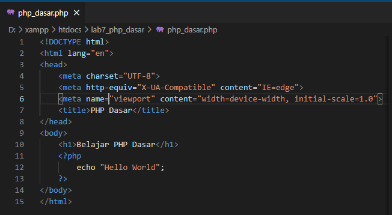

Kemudian akses hasilnya melalui URL: `http://localhost/lab7_php_dasar/php_dasar.php`

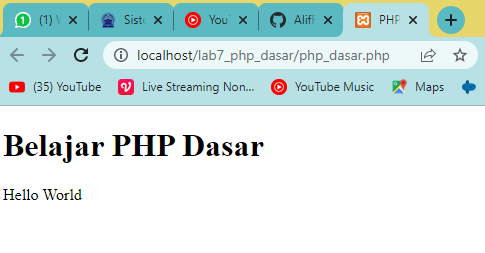

## Variabel PHP
Menambahkan variabel pada program PHP

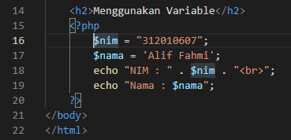

Untuk hasilnya seperti ini

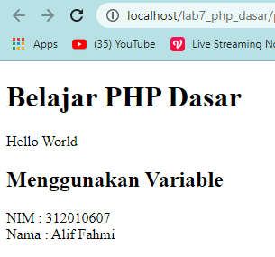

## Predefine Variable $_GET
Membuat Predefine Variable $_GET, kodinganya seperti ini

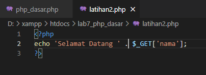

Kemudian akses hasilnya melalui URL: `http://localhost/lab7_php_dasar/latihan2.php?nama=Alif`

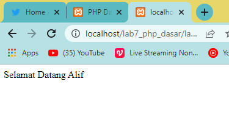

## Membuat Form Input
Buat file baru dengan nama `form_input.php`, tambahkan kodingan berikut

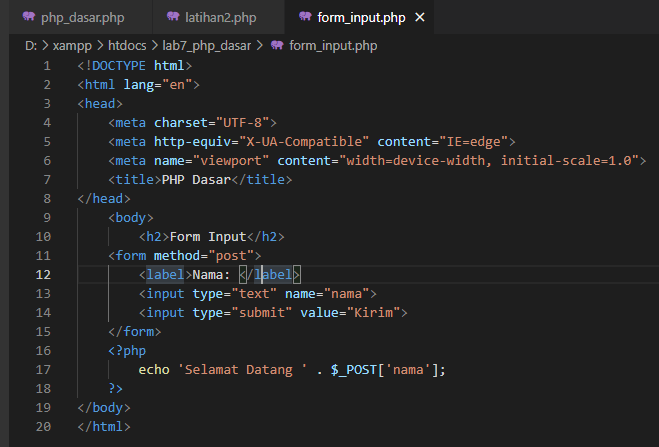

Kemudian akses hasilnya melalui URL: `http://localhost/lab7_php_dasar/form_input.php`

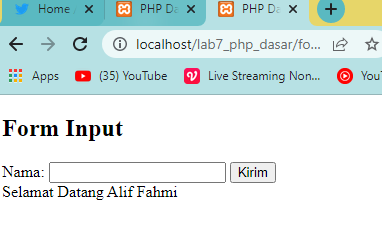

# Pertanyaan dan Tugas
Buatlah program PHP sederhana dengan menggunakan form input yang menampilkan
nama, tanggal lahir dan pekerjaan. Kemudian tampilkan outputnya dengan menghitung
umur berdasarkan inputan tanggal lahir. Dan pilihan pekerjaan dengan gaji yang
berbeda-beda sesuai pilihan pekerjaan.

## Membuat Form Input
Pertama tama membuat form input nya, berikut kodinganya

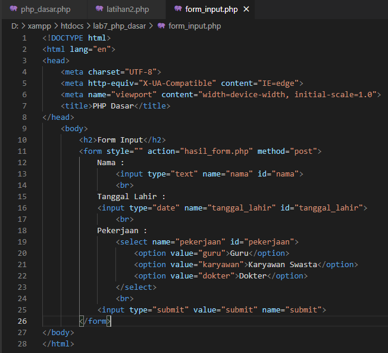

Kemudian akses hasilnya melalui URL: `http://localhost/lab7_php_dasar/form_input.php`

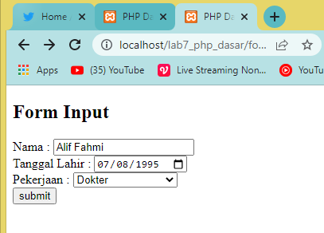

## Membuat Hasil Input
Kemudian membuat hasil dari inputan formnya, kodinganya seperti ini

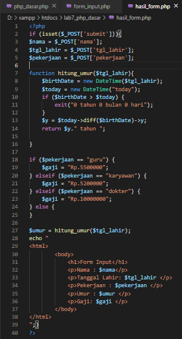

Kemudian saat kita klik `submit` pada form input maka hasilnya akan seperti ini

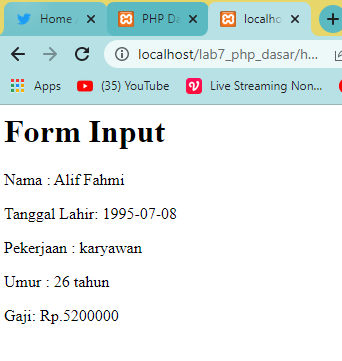

